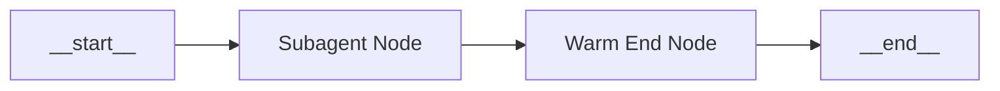
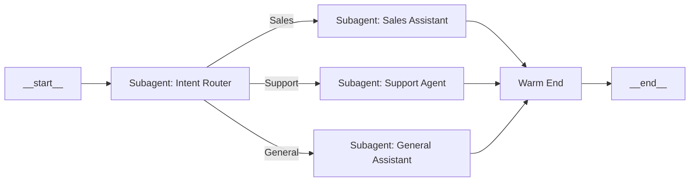

Start and End nodes are special system nodes that define the execution boundaries of every Agent Graph. These nodes are automatically created and cannot be deleted.

## Common patterns

### Recommended architecture

### Multi-context agent

## Purpose & functionality

**Start Node (`__start__`):** Marks the entry point for all agent executions. When an agent is invoked (via message, webhook, or test), execution always begins here. The Start node has no prompt and exists solely to define where the graph begins processing.

**End Node (`__end__`):** Immediately terminates agent execution when reached. No further processing occurs after hitting an End node. The final state of the conversation is preserved at the point of termination.

## Configuration

**Start Node:**
- **Name:** `__start__` (system-defined, cannot be changed)
- **Prompt:** None (Start nodes are empty by design)
- **Edges:** Exactly one outgoing edge required

**End Node:**
- **Name:** `__end__` (system-defined, cannot be changed)
- **Prompt:** None (End nodes perform no processing)
- **Edges:** No outgoing edges allowed (terminal node)

## Technical details

- Start nodes are identified by the name `START` constant from LangGraph
- End nodes are identified by the name `END` constant from LangGraph
- The graph builder skips Start nodes when adding node logic, only processing their edges
- End nodes are completely skipped during graph construction as they're terminal

## Best practices

- **Single Start:** Always maintain exactly one Start node per graph
- **Single End:** All execution paths must converge to the same End node
- **Complete Paths:** Ensure all execution paths eventually lead to the End node
- **No Orphaned Nodes:** Every node should be reachable from Start and lead to End

## Related Nodes

<CardGroup cols={3}>
  <Card title="Default Node" icon="message" href="./default-node">
    The most versatile node for general conversation
  </Card>
  <Card title="Warm End Node" icon="door-open" href="./warm-end-node">
    Alternative ending with timeout capabilities
  </Card>
  <Card title="Handoff Node" icon="hand" href="./handoff-node">
    Transfer control before natural end
  </Card>
</CardGroup>